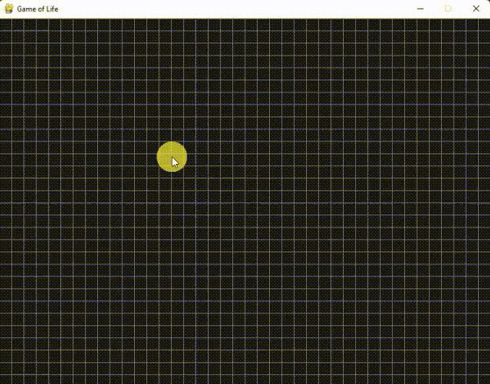

# Game_of_Life_Python
The Game of Life is a simulation of a population of cells that evolve over time according to a set of simple rules. The simulation takes place on a two-dimensional grid, where each cell can be either alive or dead↳

The rules of the Game of Life are as follows:
Any live cell with fewer than two live neighbors dies, as if by underpopulation.
Any live cell with two or three live neighbors lives on to the next generation.
Any live cell with more than three live neighbors dies, as if by overpopulation.
Any dead cell with exactly three live neighbors becomes a live cell, as if by reproduction.

Instructions:
1. The game starts paused, with any key unpause and vice versa
2. with the left mouse button, make the cells live
3. with the right mouse button, make the cells dead
4. with the center mouse button, clean the screen

have fun

